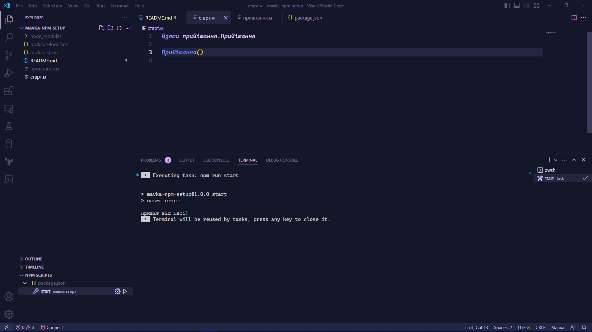

# mavka-npm-setup

Цей репозиторій містить приклад конфігурації [Мавки](https://xn--80aaf6ah.xn--j1amh/) для використання зі скриптами пакетного менеджера NPM.

## Як створити новий проект

> **Note**
> Для цього необхідно встановити NodeJS та пакетний менеджер NPM.

1. Ініціалізація

    ```bash
    npm init -y
    ```

2. Встановлення Мавки, як `devDependency`

    ```bash
    npm i -D mavka
    ```

3. У файлі [`package.json`](./package.json) замінити:

    ```json
    "scripts": {
      "test": "echo \"Error: no test specified\" && exit 1"
    },
    ```

    на

    ```json
    "scripts": {
      "start": "мавка старт"
    },
    ```

4. Створити файл [`.gitignore`](./.gitignore) із вмістом:

    ```text
    node_modules/
    ```

5. Запустити NPM скрипт `start`:

    ```bash
    npm run start
    ```

    або за допомогою палітри команд VS Code

    
